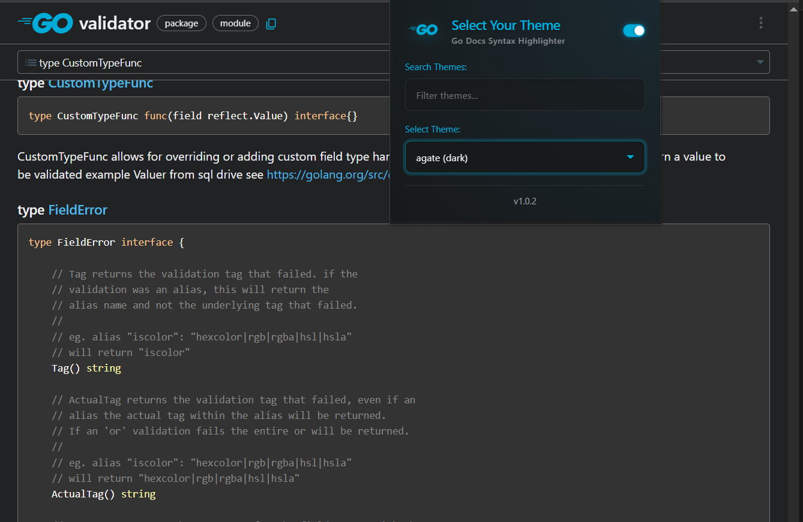
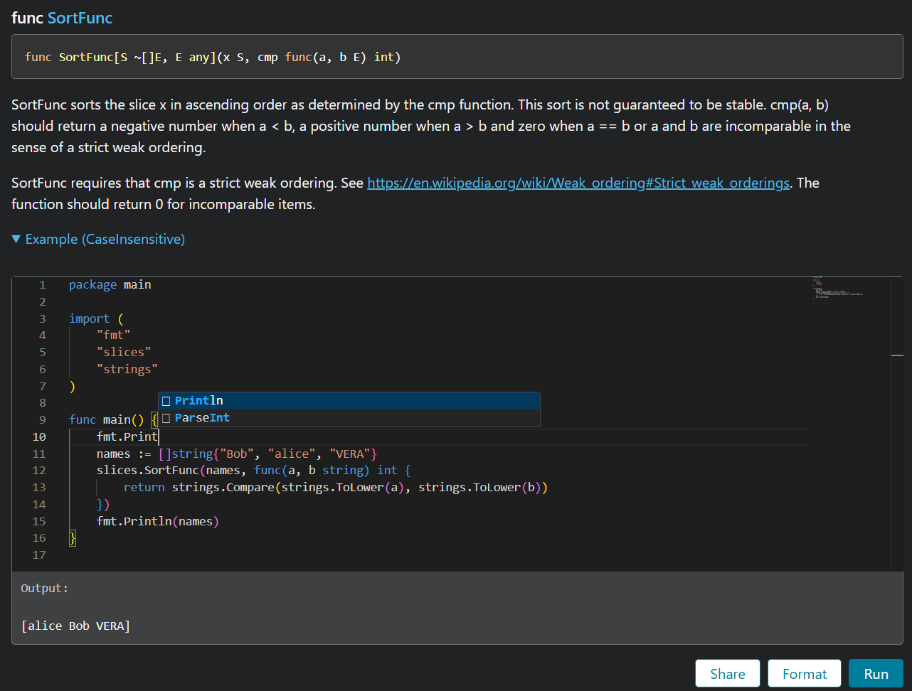

# Go Docs Syntax Highlighter (godoc-highlighter)

A Chrome extension that adds syntax highlighting to Go documentation code blocks on `pkg.go.dev`.

**Syntax highlight**:



---

**Better code playground**:



## Features

- **Syntax Highlighting**: Automatically detects and highlights Go code blocks using Highlight.js.
- **Interactive Code Editors**: Injects Monaco Editor into code textareas for a premium viewing and editing experience.
- **200+ Themes**: Choose from a vast collection of themes to customize your reading experience.
- **Searchable Popup**: Quickly find your favorite theme with the built-in search bar.
- **Easy to Use**: Simple popup interface for quick theme switching and settings.

## Installation

To install the extension manually, follow these steps:

1.  **Enable Developer Mode**: Open Chrome and navigate to `chrome://extensions/`. Toggle the **Developer mode** switch in the top right corner.
2.  **Download the Release**: Download the latest release `.zip` file from the [GitHub Releases](https://github.com/remvn/godoc-highlighter/releases) page.
3.  **Unzip**: Extract the contents of the downloaded `.zip` file to a folder on your computer.
4.  **Load Unpacked**: In the `chrome://extensions/` page, click the **Load unpacked** button and select the folder where you unzipped the extension.

## Development

If you want to contribute or build the extension from source:

### Prerequisites

- [Node.js](https://nodejs.org/) (v24 or higher recommended)
- [npm](https://www.npmjs.com/)

### Steps

1.  Clone the repository:
    ```bash
    git clone https://github.com/remvn/godoc-highlighter.git
    cd godoc-highlighter
    ```
2.  Install dependencies:
    ```bash
    npm install
    ```
3.  Start development mode with HMR:
    ```bash
    npm run dev
    ```
4.  Build for production:
    ```bash
    npm run build
    ```

## Technologies Used

- **Vite**: Next-generation frontend tooling.
- **CRXJS**: Vite plugin for building Chrome extensions.
- **TypeScript**: Typed JavaScript for better development experience.
- **Highlight.js**: Powerful syntax highlighting library.
- **Monaco Editor**: High-quality interactive code editing and viewing.
